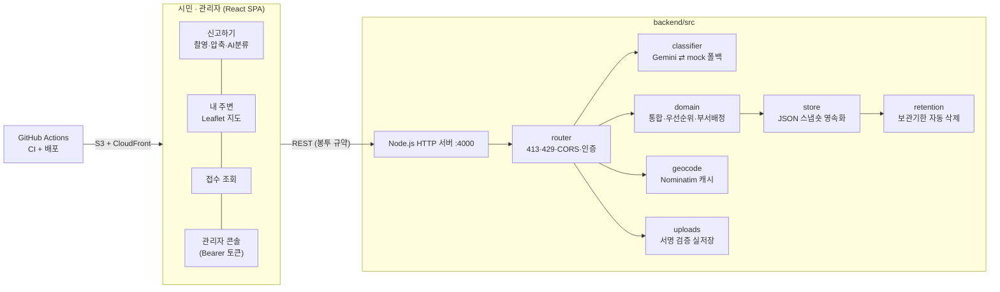

# 「모아」 — AI 생활 인프라 유지관리 플랫폼

> **같은 신고는 모으고, 누구나 3단계로 신고하게.**

고려대 세종 산업체 실습 4팀의 MVP입니다. (학습용 가상 공고 [2026-세종-0002] 대응)

**앱 설치·로그인 없이** 사진 한 장과 위치로 생활 불편을 신고하면, AI가 유형을 분류하고 **유사 신고를 하나의 문제로 통합**해 담당자에게 우선순위대로 전달합니다. 신고자는 접수증의 조회 링크로 처리 상태를 끝까지 확인합니다.

| 시민의 문제 | 담당자의 문제 | 시스템의 문제 |
|---|---|---|
| 앱 설치·회원가입·긴 양식 — 신고 문턱이 높아 디지털 취약층이 포기한다 | 같은 문제가 별개 민원으로 쌓여 처리보다 중복 확인에 시간을 쓴다 | 접수 순서 중심 처리로 위험한 문제가 뒤로 밀린다 |

## 지금 동작하는 것

**시민 앱** — 하단 3탭 (모바일 우선, PC는 와이드 레이아웃)

- **신고하기**: 촬영(자동 압축 + AI 유형 분류) → 위치 확인(지도 핀 드래그 보정 + **실주소 자동 표시**) → 접수증 발급. 사진은 **실제로 업로드**되어 서버에 저장
- **내 주변**: 반경 500m~3km 신고를 지도·목록으로 확인, '나도 불편해요' 공감
- **접수 조회**: 접수번호+토큰 무로그인 조회, 이 기기에서 낸 신고는 **내 신고 보관함**에 자동 저장
- **유사 신고 통합**: 반경 50m·같은 유형·72시간 내 신고를 후보로 제시 → 신고자가 '기존 문제에 추가' 선택
- **접근성**: 글자 크기 100~160% · 고대비 모드 (모든 화면, 설정은 기기에 저장)

**관리자 콘솔** (`/admin` — 토큰 게이트)

- 우선순위 정렬(`위험도 + 신고 건수 + 공감(상한 5)`) · AI 신뢰도 70% 미만 **검수 큐**
- 통합된 신고 **실사진 비교** · 상태 변경(접수→배정→처리중→완료, 시민 화면 즉시 반영)
- 수동 재분류 · 스팸 처리 · 오통합 분리(우선순위 자동 재계산) · 처리 이력 타임라인

## 아키텍처



- **Frontend**: React 18 + Vite, Leaflet+OpenStreetMap(키 불필요), Pretendard·고운돋움
- **Backend**: 순수 node:http (프레임워크 무의존) — 서버리스 전환 시 라우터만 이식
- **AI**: `MOA_GEMINI_API_KEY` 설정 시 **Gemini 비전 실분류**(무료 키: aistudio.google.com/apikey), 미설정·장애 시 결정적 mock 폴백
- **품질 게이트**: PR마다 백엔드 테스트 **113개** + 프론트 빌드가 필수 체크 — 깨진 코드는 머지 불가

## 실행 방법

> Node.js 20 이상 · 터미널 2개

```bash
# 터미널 1 — 백엔드 (:4000)
cd backend
npm start

# 터미널 2 — 프론트엔드 (:5173)
cd frontend
npm install     # 최초 1회
npm run dev
```

- 시민 앱 http://localhost:5173 · 관리자 http://localhost:5173/admin
- **관리자 토큰**: 백엔드 시작 로그의 `관리자 토큰(자동 생성): xxxx`를 게이트에 입력 (고정하려면 `MOA_ADMIN_TOKEN` 설정). 콘솔은 **항상 잠겨 있습니다**
- 데이터는 `backend/data/moa-data.json` 스냅숏으로 **재시작해도 유지** — 초기화는 이 파일과 `backend/uploads/` 삭제
- 테스트 `cd backend && npm test` · 분류 정확도 표본 `npm run eval`

<details>
<summary><b>백엔드 환경변수 (전부 선택)</b></summary>

| 변수 | 기본값 | 용도 |
|---|---|---|
| `MOA_PORT` | 4000 | 포트 (`PORT`보다 우선 — 개발 도구 주입 사고 방지) |
| `MOA_GEMINI_API_KEY` | (없음 → mock) | Gemini 비전 실분류 |
| `MOA_ADMIN_TOKEN` | (자동 생성 → 콘솔 출력) | 관리자 Bearer 인증 — **배포 시 고정값 필수** |
| `MOA_ALLOWED_ORIGIN` | `*` | CORS를 프론트 origin으로 제한 |
| `MOA_DATA_FILE` | `./data/moa-data.json` | 영속화 파일 (`off`면 인메모리) |
| `MOA_UPLOAD_DIR` | `./uploads` | 신고 사진 저장 경로 |
| `MOA_MAX_BODY_BYTES` | 15MB | 요청 본문 상한 (초과 413) |
| `MOA_REPORT_LIMIT` | 5 | IP당 시간당 신고 한도 (초과 429) |
| `MOA_EMPATHY_WINDOW_MS` | 1시간 | 같은 IP 공감 재시도 간격 |
| `MOA_RETENTION_SWEEP_MS` | 1시간 | 개인정보 보관기한 스윕 주기 |

</details>

## 보안·개인정보 (RFP SER-001·003 대응)

- 위치정보는 **목적·항목·기간 고지 + 동의** 후에만 수집, 동의 사실·시각을 신고에 기록
- 상태 조회는 접수번호+**SHA-256 해시 보관 토큰** 둘 다 필수 — 없는 번호·틀린 토큰 모두 403(존재 여부 은닉), 응답은 `no-store`
- 시민 응답에 사진·정밀 위치·연락처 미노출 · 업로드는 presign 서명 검증 + UUID 키
- **보관기한 자동 삭제**: 처리 완료 후 연락처 30일·사진/위치/토큰 6개월 — 스윕이 실제로 돈다 ([정책 문서](docs/PRIVACY_POLICY.md))
- 남용 방지: 신고 5건/시간·공감 1회/시간(IP당) · 우선순위 공감 기여 상한 +5 · 본문 15MB 상한

## 배포

- **프론트**: main 머지 → GitHub Actions → S3+CloudFront 자동 배포(+스모크 테스트·실패 시 롤백) — [DEPLOYMENT.md](docs/DEPLOYMENT.md)
- **백엔드**: 현재 로컬 Node 서버. 클라우드 이전 시 필수 env는 DEPLOYMENT.md 참고

### 아직 안 되는 것

| 기능 | 상태 |
|---|---|
| S3 사진 저장 | 로컬 디스크 실저장 — `MOA_STORAGE` 분기 주석으로 전환 지점 표시 |
| Gemini 키 없는 환경 | mock 분류 폴백 (파일명 힌트 기반이라 실사진 정확도 제한) |
| 백엔드 클라우드 배포 | 서버리스 연동은 후속 — 그 전까지 배포 URL은 화면만 동작 |

## 문서

| 목적 | 문서 |
|---|---|
| 👋 팀원 온보딩 | [START_HERE.md](docs/START_HERE.md) |
| 협업 규칙 (사람별 브랜치·PR·보드) | [COLLABORATION.md](docs/COLLABORATION.md) · [GIT_QUICKSTART.md](docs/GIT_QUICKSTART.md) |
| 📄 API 계약 v1 (FE·BE 공통 기준) | [API_CONTRACT.md](docs/API_CONTRACT.md) |
| 개인정보 보관·삭제 정책 | [PRIVACY_POLICY.md](docs/PRIVACY_POLICY.md) |
| 배포 가이드 | [DEPLOYMENT.md](docs/DEPLOYMENT.md) |
| 제안 배경 | [2주차 입찰 제안서 (PDF)](docs/2주차_입찰제안서_모아.pdf) · [1주차 아이디어 노트](docs/1주차_초기아이디어노트.html) |

## 팀

| 이름 | 역할 | 브랜치 |
|---|---|---|
| 심송언 | FE-A (프론트엔드) | `songeon` |
| 김재용 | FE-B (프론트엔드) | `jaeyong` |
| 가동진 | BE (백엔드) | `dongjin` |
| 김성현 | AI · Admin (AI 분류·관리자·인프라) | `sunghyun` |

**협업 규칙 요약** — main 직접 push 금지 · **사람별 브랜치**(멘토 권장)에서 작업 → PR(`Closes #N`) → CI 통과 + 리뷰 1인 → Squash merge · 진행 상황은 [칸반 보드](https://github.com/users/SungHyunC/projects/1)
